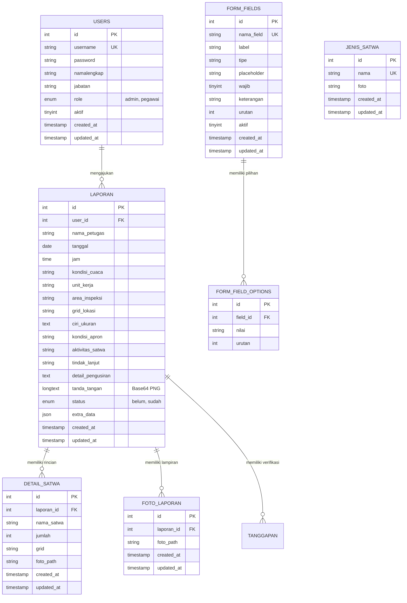
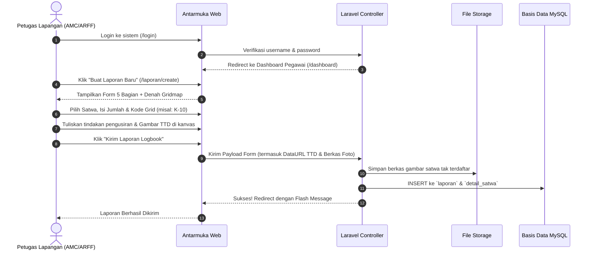
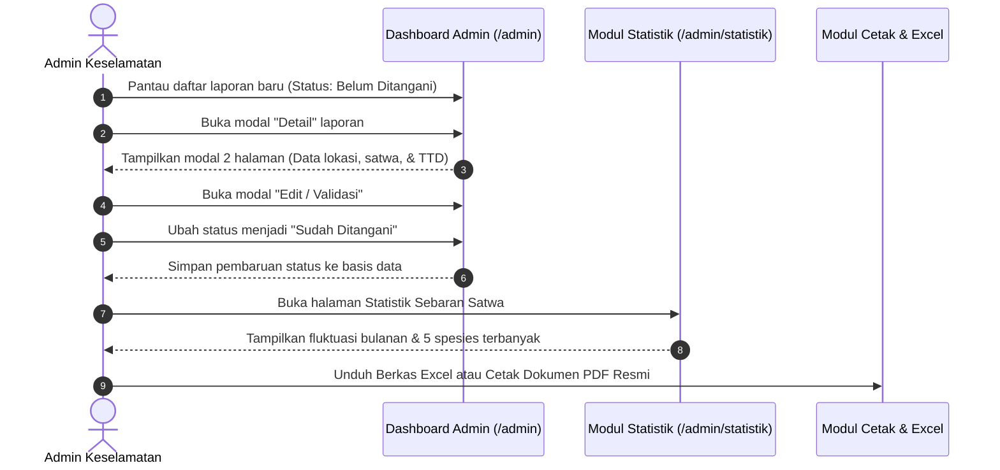

# PRODUCT REQUIREMENTS DOCUMENT (PRD)
## Logbook Bahaya Satwa Liar (Wildlife Hazard Management System)
### PT Angkasa Pura (Persero)

---

## 1. Executive Summary & Visi Produk

| Informasi Dokumen | Keterangan |
| :--- | :--- |
| **Nama Produk** | Wildlife Hazard Management Logbook System (Portal Satwa Liar) |
| **Organisasi / Instansi** | PT Angkasa Pura (Persero) |
| **Versi Produk** | 2.0 (Arsitektur Laravel MVC Modern) |
| **Klasifikasi Sistem** | Aplikasi Web Internal Operasional Sisi Udara (Airside Operations) |
| **Target Pengguna** | Unit AMC, ARFF, Avsec/Perimeter Security, SMS & OHS, serta Tim Manajemen Operasi Bandara |

### Visi Produk
Mewujudkan sistem pencatatan, pemantauan, analisis, dan pelaporan terpadu berbasis digital untuk mitigasi risiko bahaya satwa liar (*wildlife hazard*) di area sisi udara bandara guna menjamin standar tertinggi keselamatan penerbangan (*flight safety*) sesuai standar regulasi nasional dan internasional.

---

## 2. Latar Belakang & Problem Statement

### 2.1 Konteks Bisnis & Regulasi
Keberadaan satwa liar di lingkungan bandar udara (seperti burung migran, biawak, anjing/kucing liar, dan ular di area *runway*, *taxiway*, maupun *apron*) merupakan ancaman nyata terhadap keselamatan operasional pesawat (*wildlife strike hazard*). Standar keselamatan penerbangan mewajibkan pengelola bandara memiliki sistem dokumentasi dan mitigasi risiko satwa liar:
- **ICAO Annex 14** (*Aerodrome Design and Operations*) Bab 9.
- **ICAO Doc 9137** (*Airport Services Manual Part 3 - Wildlife Control and Reduction*).
- **Peraturan Direktur Jenderal Perhubungan Udara** mengenai Pengelolaan Bahaya Akibat Satwa Liar di Bandar Udara.

### 2.2 Permasalahan yang Dihadapi (Problem Statement)
1. **Pencatatan Manual / Fragmented**: Sebelum sistem ini ada, petugas mencatat temuan satwa menggunakan formulir kertas atau pesan instan yang rentan hilang, tercecer, dan tidak terstandar.
2. **Ketiadaan Pemetaan Spasial yang Akurat**: Penentuan lokasi satwa di lapangan sering kali samar atau multitafsir, menyulitkan tim pengendalian satwa (*dispersal team*) untuk menentukan titik rawan secara presisi.
3. **Analisis Tren yang Lambat**: Mengidentifikasi musim migrasi satwa, spesies yang paling sering muncul, dan zona grid dengan konsentrasi satwa tinggi membutuhkan rekapitulasi manual yang memakan waktu berhari-hari.
4. **Validasi & Akuntabilitas Dinas**: Ketiadaan bukti autentik digital (seperti tanda tangan basah digital dan bukti foto dokumentasi) menyulitkan proses verifikasi dan audit kepatuhan (*safety audit*).

---

## 3. Profil Pengguna & Stakeholder (User Personas)

```mermaid
graph TD
    subgraph Pengguna Lapangan (Field Officers)
        AMC[Unit AMC - Apron Movement Control]
        ARFF[Unit ARFF - Rescue & Fire Fighting]
        SEC[Unit Avsec / Security Perimeter]
        SMS[Unit SMS & OHS - Safety Management]
    end

    subgraph Manajemen & Pengendali
        ADM[Admin Operasional / General Manager]
        AUD[Auditor Keselamatan Penerbangan]
    end

    AMC -->|Input Laporan Temuan Satwa| System[Portal Satwa Liar Angkasa Pura]
    ARFF -->|Input Tindakan Pemadaman/Pengusiran| System
    SEC -->|Input Monitoring Perimeter| System
    SMS -->|Monitoring K3 & Hazard Sisi Udara| System
    System -->|Validasi & Edit Laporan| ADM
    System -->|Statistik & Visualisasi Sebaran| ADM
    System -->|Cetak Berita Acara & Excel Rekap| AUD
```

### 3.1 Persona Pengguna

#### 1. Petugas Lapangan (*Field Inspector / Operator*)
- **Role Akun**: `pegawai`
- **Unit Terlibat**: AMC, ARFF, Security, SMS & OHS.
- **Karakteristik**: Mengoperasikan aplikasi langsung dari perangkat lapangan (*mobile / tablet*) atau komputer pos dinas di sisi udara.
- **Tugas Utama**: Mengisi formulir temuan satwa liar, menandai kode koordinat grid bandara, mendokumentasikan foto, dan membubuhkan tanda tangan digital basah.

#### 2. Administrator & Pengelola Keselamatan (*Safety Manager*)
- **Role Akun**: `admin`
- **Unit Terlibat**: Wildlife Hazard Management Lead, Safety Manager, General Manager.
- **Karakteristik**: Mengakses dashboard manajerial melalui workstation kantor.
- **Tugas Utama**: Memvalidasi laporan masuk, memantau tren bulanan dan sebaran spasial grid melalui grafik interaktif, mengelola master spesies satwa, menyesuaikan konfigurasi formulir dinamis (*form builder*), serta mengekspor Berita Acara resmi (PDF) dan laporan rekapitulasi (Excel).

---

## 4. Arsitektur Teknis Sistem

Sistem dibangun menggunakan pola arsitektur **Model-View-Controller (MVC)** modern berbasis **Laravel 12**:

```mermaid
graph LR
    subgraph Client Tier
        Browser[Browser Desktop / Tablet / Smartphone]
        Tailwind[Tailwind CSS v4 + DM Sans Typography]
        Vite[Vite Bundler Hot Reload]
    end

    subgraph Application Tier (Laravel 12)
        Route[Router / routes/web.php]
        AuthMid[Auth & RoleMiddleware]
        Controllers[App Controllers]
        Blade[Blade Template Views]
    end

    subgraph Data Tier (MySQL 8 / MariaDB)
        Eloquent[Eloquent ORM Engine]
        DB[(Database logbook_project_baru)]
        Storage[(Local Storage / Public Uploads)]
    end

    Browser -->|HTTP Requests| Route
    Route --> AuthMid
    AuthMid --> Controllers
    Controllers --> Blade
    Blade -->|Rendered HTML + Assets| Browser
    Controllers --> Eloquent
    Eloquent --> DB
    Controllers --> Storage
```

### Spesifikasi Stack Teknologi:
- **Backend Framework**: Laravel 12.x (PHP 8.5)
- **Frontend Framework / Styling**: Tailwind CSS v4 (menggunakan CSS-first theme config `@theme`), Vite 8.x
- **Basis Data**: MySQL / MariaDB dengan *foreign key constraints* dan indeks performa
- **Pustaka Interaktif**:
  - `SignaturePad.js` (Canvas HTML5 untuk penangkapan tanda tangan basah digital)
  - `Chart.js` (Visualisasi data *Stacked Bar Chart* bulanan)
- **Keamanan**: CSRF Protection, Bcrypt Password Hashing, Session Hijacking Protection, Role-based Routing Middleware

---

## 5. Spesifikasi Fungsional (Core Modules & Requirements)

### Modul 1: Autentikasi & Pengaturan Hak Akses
- **ID Kebutuhan**: `REQ-AUTH-001`
- **Deskripsi**: Sistem mengotentikasi pengguna dinas berdasarkan username dan password terenkripsi.
- **Kriteria Penerimaan**:
  1. Pengguna login melalui antarmuka khusus ber-desain *glassmorphism* dengan latar belakang watermark resmi InJourney.
  2. Sistem mengenali role pengguna: `admin` otomatis diarahkan ke `/admin`, dan `pegawai` otomatis diarahkan ke `/dashboard`.
  3. Proteksi sesi dinas (*session regenerate*) saat login untuk mencegah *session fixation*.
  4. Middleware keamanan menolak pengguna non-admin yang mencoba mengakses URL ber-prefiks `/admin`.

---

### Modul 2: Formulir Pelaporan & Inventarisasi Satwa Terpadu
- **ID Kebutuhan**: `REQ-FORM-002`
- **Deskripsi**: Formulir 5 bagian terstruktur bagi petugas untuk mendokumentasikan temuan satwa di lapangan.
- **Rincian Bagian Formulir**:
  1. **Bagian 1 — Identitas & Kondisi Pemantauan**:
     - Nama Petugas (otomatis terisi nama user login).
     - Tanggal & Jam Pemantauan.
     - Kondisi Cuaca (*Cerah, Berawan, Hujan Ringan, Hujan Lebat*).
     - Unit Kerja (*AMC, ARFF, Security, SMS & OHS*).
     - Area Inspeksi (*Runway, Taxiway, Apron, Perimeter, Drainage/Kanal*).
  2. **Bagian 2 — Inventarisasi Satwa Liar Interaktif**:
     - Menampilkan kartu katalog master satwa (Biawak, Kucing Liar, Burung Blekok, Kuntul, dll.) lengkap dengan gambar.
     - Petugas dapat memilih beberapa satwa sekaligus (*multi-select*).
     - Untuk setiap satwa yang dipilih, petugas dapat menambahkan **multi-titik sebaran lokasi** (Jumlah Ekor + Kode Grid) secara dinamis.
     - Tersedia kolom unggah berkas foto khusus satwa yang tidak terdaftar (*unlisted species*).
  3. **Bagian 3 — Peta Koordinat Gridmap Bandara**:
     - Menampilkan denah resmi *Airside Gridmap InJourney* sebagai acuan spasial visual.
     - Kolom input grid koordinat utama (contoh: `K-10`, `F-5`, `D-9`).
  4. **Bagian 4 — Kondisi & Tindakan Pengusiran (*Dispersal Action*)**:
     - Ciri-ciri morfologi & perkiraan ukuran satwa.
     - Kondisi saat ditemukan (*Hidup, Mati, Tidak Ditemukan*).
     - Aktivitas satwa di lapangan (*Melintas, Bertengger, Mencari Makan, Melayang Rendah*).
     - Tindak lanjut penanganan (*Belum Ditangani, Telah Ditangani*).
     - Deskripsi metode pengusiran yang diterapkan (Alat sirene, kembang api petasan, jaring, pengusiran manual).
  5. **Bagian 5 — Tanda Tangan Digital Basah**:
     - Kanvas interaktif untuk membubuhkan tanda tangan langsung menggunakan sentuhan jari (*touchscreen*) atau kursor mouse.
     - Tombol hapus & tanda tangan ulang jika terjadi kekeliruan.
     - Validasi sistem: Formulir tidak dapat dikirimkan jika tanda tangan digital masih kosong.

---

## 3. Modul 3: Dashboard Operasional & Verifikasi Admin
- **ID Kebutuhan**: `REQ-DASH-003`
- **Deskripsi**: Pusat pemantauan operasional bagi manajemen dan admin bandara.
- **Fitur Utama**:
  1. **Stat Summary Cards**: 3 kartu metrik ringkasan dengan gradasi warna (*Total Laporan*, *Belum Ditangani*, *Telah Ditangani*).
  2. **Toolbar Pencarian & Filter Cepat**:
     - Filter berdasarkan status (*Semua, Belum Ditangani, Sudah Ditangani*).
     - Pencarian real-time kata kunci (*nama petugas, area inspeksi, kode grid*).
     - Tombol cepat **Export Excel**.
  3. **Tabel Master Data**:
     - Menampilkan nomor laporan, tanggal, nama petugas, unit kerja, area/grid, dan *status badge*.
     - Tombol aksi terpadu dengan ikon jelas: **Detail**, **Edit / Validasi**, dan **Hapus**.
  4. **Modal Pratinjau Detail 2 Halaman**:
     - *Halaman 1*: Rincian lengkap identitas petugas, waktu, cuaca, unit kerja, area, dan grid utama.
     - *Halaman 2*: Rincian spesies satwa yang ditemukan (dilengkapi foto & grid temuan), deskripsi tindakan pengusiran, dan pratinjau tanda tangan digital petugas.
     - Tombol langsung untuk mencetak Berita Acara PDF dinas.
  5. **Modal Validasi Cepat**: Admin dapat langsung memperbarui status laporan dari *Belum Ditangani* menjadi *Sudah Ditangani* beserta koreksi data lapangan jika diperlukan.

---

### Modul 4: Statistik & Visualisasi Sebaran Spasial Satwa
- **ID Kebutuhan**: `REQ-STAT-004`
- **Deskripsi**: Modul analitik untuk mengevaluasi efektivitas program mitigasi bahaya satwa liar tahunan.
- **Fitur Utama**:
  1. **Stacked Bar Chart Fluktuasi Bulanan**:
     - Grafik batang bertumpuk yang memvisualisasikan jumlah temuan per spesies setiap bulan (Januari hingga Desember).
     - Palet warna unik untuk setiap spesies satwa agar mudah dibedakan.
  2. **Filter Multi-Dimensi**:
     - Filter berdasarkan Tahun (5 tahun terakhir).
     - Filter berdasarkan Zona Grid spesifik (misal: hanya temuan di grid `K-10` atau `D-9`).
     - Pencarian teks jenis satwa tertentu.
  3. **Top 5 Spesies Terbanyak**: Panel peringkat spesies satwa liar yang paling mendominasi di tahun terpilih lengkap dengan total individu ekor.
  4. **Zona Grid Aktif**: Daftar *tag button* dari seluruh grid koordinat yang memiliki riwayat temuan satwa. Mengklik kode grid akan langsung memfilter grafik pada zona tersebut.

---

### Modul 5: Manajemen Sistem (Form Builder, Satwa, & User)
- **ID Kebutuhan**: `REQ-MGT-005`
- **Deskripsi**: Kemudahan mengonfigurasi formulir dinamis dan master data tanpa perlu mengubah kode sumber aplikasi.
- **Fitur Utama**:
  1. **Tab 1 — Field Formulir (Dynamic Form Fields)**:
     - Admin dapat menambah, mengedit urutan, menonaktifkan, atau menghapus input form.
     - Mendukung tipe input: *Teks Pendek*, *Teks Panjang (Textarea)*, *Dropdown Pilihan*, *Tanggal*, *Angka*, dan *Gridmap Gambar*.
  2. **Tab 2 — Katalog Master Jenis Satwa**:
     - Menambah spesies baru lengkap dengan unggahan foto dokumentasi referensi.
     - Mengubah nama spesies atau memperbarui foto satwa.
  3. **Tab 3 — Manajemen Pengguna (Users)**:
     - Menambahkan akun dinas baru (AMC, ARFF, Avsec, SMS & OHS).
     - Mengubah kata sandi pengguna atau menonaktifkan akun yang sudah tidak aktif bertugas.

---

### Modul 6: Pelaporan & Ekspor Berkas Resmi Dinas
- **ID Kebutuhan**: `REQ-REP-006`
- **Deskripsi**: Pembuatan dokumen formal untuk keperluan audit kepatuhan Ditjen Perhubungan Udara dan arsip manajemen.
- **Fitur Utama**:
  1. **Cetak Berita Acara / Laporan Satwa Liar (PDF Ready)**:
     - Layout A4 berstandar dokumen resmi PT Angkasa Pura (Persero).
     - Dilengkapi kop dinas resmi, nomor laporan otomatis, tabel rincian temuan satwa, rincian tindakan pengendalian, dan tanda tangan basah digital pelapor.
     - Menggunakan stylesheet `@media print` otomatis yang menyembunyikan navigasi web saat dicetak atau disimpan sebagai PDF.
  2. **Ekspor Spreadsheet Excel (.xls / CSV)**:
     - Mengunduh seluruh atau sebagian data rekapitulasi sesuai filter tahun/bulan/zona ke format spreadsheet untuk analisis lanjutan.

---

## 6. Skema Basis Data & Relasi Entitas (ERD)



---

## 7. Alur Pengguna (User Journeys)

### 7.1 Alur Pelaporan Petugas Lapangan



### 7.2 Alur Verifikasi & Analisis Manajemen Admin



---

## 8. Persyaratan Non-Fungsional (Non-Functional Requirements)

| Kategori | Parameter | Spesifikasi & Standar yang Dipenuhi |
| :--- | :--- | :--- |
| **Keamanan** | Enkripsi Sandi | Algoritma *Bcrypt hashing* dengan *cost factor* dinamis Laravel. |
| **Keamanan** | Proteksi Serangan Web | Proteksi otomatis terhadap CSRF (*Cross-Site Request Forgery*), SQL Injection (via PDO Prepared Statements), dan XSS (*Cross-Site Scripting* via Blade escaping). |
| **Keamanan** | Validasi Berkas | Berkas foto yang diunggah divalidasi ekstensi (`jpg, jpeg, png, webp`) dan ukuran maksimum (maksimal 5MB per berkas). |
| **Performa** | Waktu Muat Halaman | Rata-rata waktu tanggap halaman < 800ms pada koneksi jaringan lokal bandara. |
| **Performa** | Bundling Aset | Aset CSS dan JS dikompilasi menggunakan Vite minifikasi (ukuran total bundel Tailwind < 75 KB gzipped). |
| **Responsivitas** | Desain Antarmuka | Sepenuhnya responsif menggunakan flexbox dan grid Tailwind CSS v4, dapat diakses sempurna melalui smartphone (Android/iOS), tablet operasional, maupun monitor desktop PC. |
| **Integritas Data**| Basis Data | Menggunakan *InnoDB storage engine* dengan integritas referensial *Foreign Key Cascade* pada rincian laporan. |

---

## 9. Rencana Pengembangan Selanjutnya (Future Roadmap)

1. **Integrasi Koordinat Geospasial (GIS & GPS Real-time)**:
   - Memungkinkan petugas menyalakan lokasi GPS perangkat untuk otomatis mendeteksi kode grid bandara di mana satwa ditemukan.
2. **Notifikasi Otomatis (WhatsApp / Telegram Bot Integration)**:
   - Pengiriman peringatan otomatis ke grup koordinasi operasional sisi udara ketika ada satwa berisiko tinggi (misal: biawak masuk ke area runway aktif).
3. **Pencatatan Integrasi Peralatan Pengusir Satwa (Bird Dispersal Device IoT)**:
   - Menghubungkan logbook dengan alat pengusir satwa otomatis seperti *gas cannon* atau *acoustic bird repeller*.
4. **Analisis Prediktif Berbasis AI / Machine Learning**:
   - Memprediksi lonjakan populasi satwa berdasarkan tren musiman cuaca, arah angin, dan jadwal panen di sekitar perimeter luar bandara.
