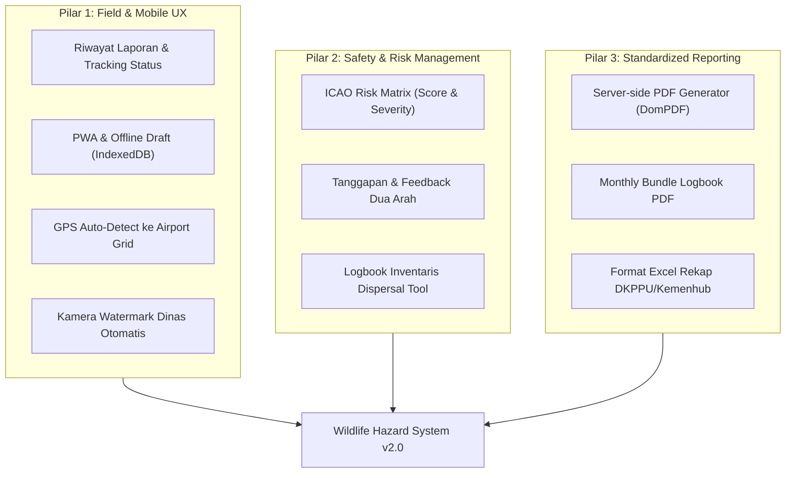
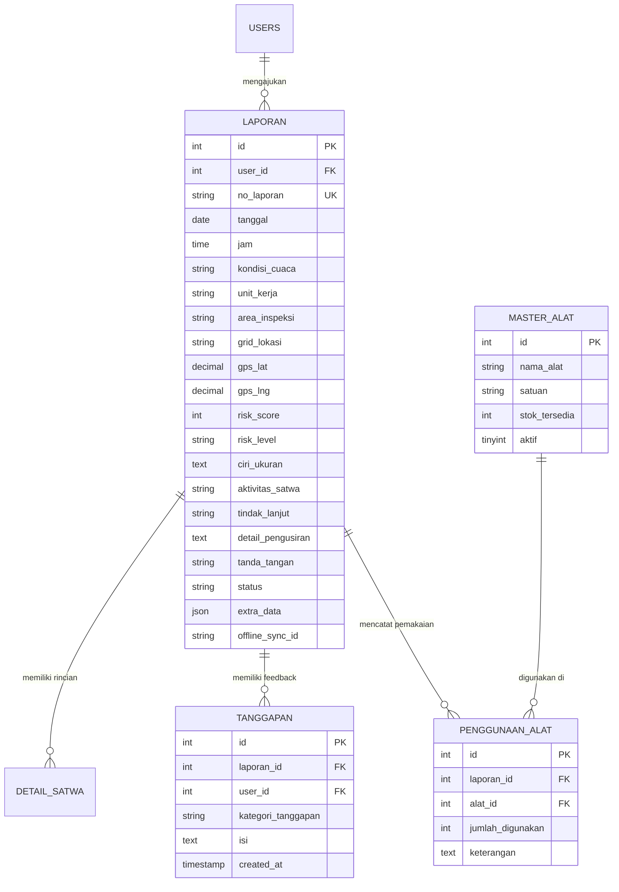

# PRODUCT REQUIREMENTS DOCUMENT (PRD) v2.0
## Wildlife Hazard Management System (Portal Satwa Liar)
### PT Angkasa Pura (Persero) — InJourney Airports
**Fokus Pengembangan: Field & Mobile UX, ICAO Risk Assessment, & Standardized Reporting**

---

## 1. Executive Summary & Visi Pengembangan Versi 2.0

| Parameter Dokumen | Informasi |
| :--- | :--- |
| **Judul Proyek** | Wildlife Hazard Management Logbook System — Enhancement v2.0 |
| **Instansi / Bandara** | PT Angkasa Pura (Persero) / InJourney Airports |
| **Versi Dokumen** | 2.0 (Lanjutan dari Versi 1.0 Migrasi Laravel MVC) |
| **Status Dokumen** | Approved for Development |
| **Regulasi Rujukan** | • ICAO Annex 14 (*Aerodrome Design and Operations*) • ICAO Doc 9137 Part 3 (*Wildlife Control and Reduction*) • KP Ditjen Hubud tentang Pedoman Pengelolaan Bahaya Satwa Liar |
| **Target Pengguna** | Unit AMC (*Apron Movement Control*), ARFF (*Rescue & Fire Fighting*), Avsec/Perimeter Security, SMS & OHS, Safety Manager, Auditor Kemenhub/DKPPU |

### 1.1 Visi Pengembangan
Mengembangkan sistem logbook pemantauan satwa liar dari sekadar sistem pencatatan pasif menjadi **platform mitigasi bahaya satwa liar terpadu dan proaktif**. Versi 2.0 berfokus pada 3 pilar strategis:
1. **Pemberdayaan Petugas Lapangan (*Field Officer Experience*)**: Dashboard personal riwayat laporan, kemampuan pelaporan *offline* (PWA) di area perimeter bandara, serta otomasi koordinat GPS ke Grid bandara.
2. **Kepatuhan Regulasi & Manajemen Risiko (*Safety & Risk Assessment*)**: Penilaian bahaya kuantitatif berbasis standar ICAO Doc 9137, komunikasi tindak lanjut dua arah (*Feedback/Tanggapan*), dan inventarisasi peralatan pengusir satwa (*dispersal gear*).
3. **Standarisasi Dokumen & Otomasi Ekspor (*Official Reporting*)**: Pembangkitan dokumen PDF resmi siap audit (single & bulk bundle) langsung dari server, serta ekspor spreadsheet berformat baku Ditjen Hubud (DKPPU).

---

## 2. Analisis Kesenjangan (Gap Analysis) v1.0 vs v2.0

| Aspek | Kondisi Sistem Saat Ini (v1.0) | Target Pengembangan Baru (v2.0) |
| :--- | :--- | :--- |
| **Dashboard Pegawai** | Hanya tombol "Buat Laporan Baru"; tidak ada riwayat pelaporan pribadi. | Dashboard interaktif berisi riwayat laporan, status verifikasi *real-time*, ringkasan statistik pribadi, dan unduh berkas. |
| **Konektivitas Lapangan** | Memerlukan koneksi internet stabil; input gagal jika sinyal drop di ujung *runway*. | Progressive Web App (PWA) dengan *offline draft storage* (IndexedDB) dan otomatis sinkronisasi (*auto-sync*) saat online. |
| **Penentuan Grid Lokasi** | Petugas harus mencari dan mengingat kode grid secara manual di denah gambar. | Auto-detect kode grid bandara melalui GPS perangkat (*Geolocation API*) dengan opsi koreksi manual. |
| **Dokumentasi Foto** | Unggah foto standar tanpa verifikasi waktu dan koordinat. | Kamera terintegrasi dengan otomatis menyematkan *watermark* dinas (waktu, tanggal, unit, dan koordinat GPS). |
| **Klasifikasi Risiko Satwa**| Belum ada pembobotan risiko; semua satwa dianggap memiliki dampak yang sama. | Matriks Risiko ICAO Doc 9137 otomatis (*Risk Score = Severity × Probability*) dengan penanda risiko: Rendah, Sedang, Tinggi, Kritis. |
| **Komunikasi Dua Arah** | Tabel `tanggapan` belum difungsikan; komunikasi feedback admin ke pelapor terputus. | Fitur Tanggapan & Instruksi Lanjutan langsung di detail laporan antara pelapor dan safety manager. |
| **Inventaris Alat Dispersal**| Tidak ada pencatatan pemakaian peralatan/amunisi pengusir satwa. | Modul logbook pemakaian amunisi petasan (*flare gun*), *gas cannon*, dan peralatan pengusir satwa lainnya. |
| **Pembangkitan Dokumen PDF**| Bergantung pada fitur *Print to PDF* peramban web pengguna. | Mesin PDF *server-side* murni (DomPDF/Snappy) dengan sekali klik unduh, layout A4 baku, dan bundle bulanan. |
| **Format Rekapitulasi Excel**| File tabel HTML sederhana bertipe `.xls`. | Format XLSX standar audit kepatuhan Ditjen Perhubungan Udara (DKPPU) lengkap dengan kop dan formula rekap. |

---

## 3. Spesifikasi Fungsional Rinci (Functional Requirements)

---

### PILAR 1: PENINGKATAN PENGALAMAN PETUGAS LAPANGAN (FIELD & MOBILE UX)

#### Modul 1.1: Dashboard Riwayat Laporan Pegawai (*My Reports & Status Tracking*)
* **ID Kebutuhan**: `REQ-FIELD-001`
* **Deskripsi**: Transformasi halaman `/dashboard` pegawai menjadi pusat kendali personal petugas lapangan.
* **Fitur & Kriteria Penerimaan**:
  1. Menampilkan 3 kartu metrik ringkasan pribadi petugas:
     * *Total Laporan Saya*: Seluruh laporan yang pernah dikirim oleh akun yang sedang login.
     * *Menunggu Validasi*: Jumlah laporan dengan status `belum`.
     * *Selesai / Ditangani*: Jumlah laporan dengan status `sudah`.
  2. Tabel Riwayat Laporan dilengkapi:
     * Nomor Berita Acara, Tanggal & Jam, Area/Grid, Spesies Satwa, Status Badge (*Belum Ditangani* / *Sudah Ditangani*), dan Level Risiko.
  3. Tombol Aksi Langsung pada setiap baris:
     * **Lihat Detail**: Modal pratinjau data laporan dan catatan tanggapan dari Admin.
     * **Cetak / Unduh PDF**: Tombol unduh cepat Berita Acara resmi.
  4. Filter dan pencarian riwayat berdasarkan rentang tanggal dan status penanganan.

#### Modul 1.2: Progressive Web App (PWA) & Mode *Offline Draft*
* **ID Kebutuhan**: `REQ-FIELD-002`
* **Deskripsi**: Memungkinkan aplikasi diakses dan dioperasikan di area sisi udara (*airside/perimeter*) tanpa jaringan internet.
* **Fitur & Kriteria Penerimaan**:
  1. Aplikasi memiliki `manifest.json` dan *Service Worker* sehingga dapat diinstal (*Add to Home Screen*) di perangkat Android, iOS, maupun Windows tablet dinas.
  2. Apabila perangkat kehilangan sinyal saat pengisian formulir:
     * Sistem otomatis menyimpan draf data formulir, foto (base64/Blob), dan tanda tangan digital ke dalam *IndexedDB* browser.
     * Tampil indikator status koneksi visual: badge hijau (*Online*) / oranye (*Offline Mode*).
  3. Antarmuka *Draf Belum Terkirim*: Menampilkan daftar antrean laporan yang tersimpan secara lokal.
  4. *Auto-Sync*: Begitu perangkat kembali terhubung ke sinyal Wi-Fi/seluler bandara, sistem menampilkan tombol sinkronisasi satu klik (*Sync Now*) untuk mengunggah draf ke server.

#### Modul 1.3: Deteksi Koordinat GPS Otomatis ke Grid Bandara (*Geolocation-to-Grid*)
* **ID Kebutuhan**: `REQ-FIELD-003`
* **Deskripsi**: Memanfaatkan sensor GPS perangkat petugas untuk menentukan kode grid lokasi satwa secara otomatis.
* **Fitur & Kriteria Penerimaan**:
  1. Tombol *"Deteksi Lokasi GPS Saya"* pada Bagian 3 Form Pelaporan.
  2. Mengambil koordinat *Latitude* dan *Longitude* via HTML5 Geolocation API dengan akurasi radius < 15 meter.
  3. Sistem mengonversi koordinat GPS ke kode Grid Bandara (misal: Lat `-7.3798`, Long `112.7875` $\rightarrow$ Grid `K-10`) menggunakan algoritma batas kotak poligon (*Bounding Box Geofencing*).
  4. Koordinat numerik GPS tetap disimpan ke kolom `gps_lat` dan `gps_lng` untuk keperluan pemetaan presisi tinggi.
  5. Petugas tetap memiliki kendali untuk mengoreksi pilihan grid secara manual jika diperlukan.

#### Modul 1.4: Kamera Terintegrasi & Watermark Dinas Otomatis
* **ID Kebutuhan**: `REQ-FIELD-004`
* **Deskripsi**: Menjamin keaslian dan akuntabilitas dokumentasi temuan satwa di lapangan.
* **Fitur & Kriteria Penerimaan**:
  1. Input foto satwa dapat langsung membuka kamera gawai (*HTML5 Media Capture*).
  2. Saat foto diambil, sistem *frontend* (Canvas) otomatis menyematkan bilah *watermark* semi-transparan di pojok bawah foto berisi teks:
     * `[WAKTU & TANGGAL]` (contoh: *15-09-2026 09:30:15 WIB*)
     * `[LOKASI & GRID]` (contoh: *Runway 10 - Grid K-10, Lat: -7.3798, Long: 112.7875*)
     * `[UNIT PELAPOR]` (contoh: *AMC Unit - InJourney Airports Juanda*)
  3. Mengurangi ukuran berkas secara otomatis (*client-side compression*) menjadi < 1 MB sebelum dikirim untuk menghemat kuota dan mempercepat *upload*.

---

### PILAR 2: FITUR KESELAMATAN & MANAJEMEN RISIKO (SAFETY & RISK MANAGEMENT)

#### Modul 2.1: Matriks Penilaian Risiko Satwa (*ICAO Doc 9137 Risk Matrix*)
* **ID Kebutuhan**: `REQ-RISK-001`
* **Deskripsi**: Penilaian otomatis terhadap tingkat keparahan risiko satwa liar terhadap keselamatan penerbangan.
* **Parameter Perhitungan**:
  1. **Tingkat Probabilitas (P)** dihitung berdasarkan kuantitas & frekuensi kemunculan:
     * Nilai 1: Soliter / 1 ekor di luar area kritis.
     * Nilai 2: 2–5 ekor di area pergerakan.
     * Nilai 3: Kawanan > 5 ekor di area kritis (*runway/taxiway*).
  2. **Tingkat Keparahan / Severity (S)** dihitung berdasarkan massa spesies & lokasi:
     * *Bobot Spesies*: Burung besar/flocking (Blekok/Kuntul), Anjing liar, Ular sanca = Skor Tinggi (3). Biawak sedang = Skor Sedang (2). Burung gereja kecil = Skor Rendah (1).
     * *Bobot Area*: Runway (3), Taxiway (2), Apron (2), Perimeter/Drainage (1).
  3. **Kategori Tingkat Bahaya Akhir**:
     * Skor 1 – 3: **Risiko Rendah (Low Risk - Hijau)**
     * Skor 4 – 6: **Risiko Sedang (Medium Risk - Kuning)**
     * Skor 7 – 9: **Risiko Tinggi (High Risk - Oranye)**
     * Skor > 9: **Kritis (Critical Hazard - Merah)**
* **Kriteria Penerimaan**:
  1. Sistem otomatis menghitung skor risiko saat laporan disimpan dan menyimpannya pada kolom `risk_score` dan `risk_level`.
  2. Pada dashboard admin dan user, laporan berkategori *Tinggi* dan *Kritis* memiliki *badge* berkedip/kontras dan otomatis berada pada antrean prioritas verifikasi.

#### Modul 2.2: Modul Tanggapan & Instruksi Lanjutan (Feedback Loop Dua Arah)
* **ID Kebutuhan**: `REQ-RISK-002`
* **Deskripsi**: Mengaktifkan model dan tabel `tanggapan` untuk alur koordinasi resmi antara Safety Manager dan Petugas Lapangan.
* **Fitur & Kriteria Penerimaan**:
  1. Pada Modal Detail Laporan di sisi Admin:
     * Tersedia form tanggapan dinas: *"Instruksi / Catatan Safety Unit"*.
     * Admin dapat memilih jenis tanggapan: *Instruksi Pengusiran Tambahan*, *Evaluasi Tindakan*, *Penutupan Laporan (Closed)*, atau *Permintaan Klarifikasi Data*.
  2. Pada Dashboard & Detail Laporan di sisi Pegawai:
     * Pegawai dapat membaca tanggapan resmi dari Safety Manager beserta waktu dan nama validator.
     * Pegawai dapat membalas tanggapan (contoh: *"Pengusiran lanjutan telah dilakukan dengan 2x tembakan flare gun, area aman"*).
  3. Setiap riwayat tanggapan tersimpan kronologis (*timeline thread*) dengan stempel waktu yang tidak dapat dimanipulasi (*tamper-proof*).

#### Modul 2.3: Logbook Inventaris & Pemakaian Alat Pengusir Satwa (*Dispersal Tool Inventory*)
* **ID Kebutuhan**: `REQ-RISK-003`
* **Deskripsi**: Pencatatan terintegrasi mengenai peralatan dan bahan pengusir satwa liar yang digunakan selama dinas.
* **Fitur & Kriteria Penerimaan**:
  1. Tabel master peralatan pengusir satwa:
     * Amunisi Petasan / *Bird Scaring Cartridge / Flare Gun* (butir)
     * *Gas Cannon / Propane Cannon* (unit / dentuman)
     * *Acoustic Bird Repeller* (frekuensi / durasi penggunaan)
     * Laser Repeller / Jaring Tangkap Satwa (*Mist Net*)
  2. Pada Bagian 4 Form Pelaporan:
     * Pilihan input: *"Alat yang Digunakan"* dan *"Jumlah Amunisi yang Ditembakkan"*.
  3. Sistem otomatis memotong stok amunisi unit terkait dan menghasilkan laporan rekapitulasi konsumsi amunisi bulanan untuk logistik operasional ARFF/AMC.

---

### PILAR 3: STANDARISASI PELAPORAN & EKSPOR BERKAS RESMI (STANDARDIZED REPORTING)

#### Modul 3.1: Generator Berita Acara PDF Server-Side Asli (*Native DomPDF Engine*)
* **ID Kebutuhan**: `REQ-REP-001`
* **Deskripsi**: Menghasilkan dokumen Berita Acara resmi PDF secara *native* langsung dari server tanpa bergantung pada setelan printer peramban pengguna.
* **Fitur & Kriteria Penerimaan**:
  1. Menggunakan pustaka server-side `barryvdh/laravel-dompdf`.
  2. Tombol *"Download PDF Resmi"* sekali klik langsung mengunduh file `.pdf`.
  3. Standarisasi Layout Dokumen Resmi A4:
     * Kop Surat Resmi *InJourney Airports - PT Angkasa Pura (Persero)*.
     * Nomor Registrasi Laporan Otomatis (Format: `BA-WHMS/[KODE-UNIT]/[BULAN]/[TAHUN]/[ID]`).
     * Tabel Matriks Temuan Satwa (Jenis, Jumlah, Grid, Foto Bukti dengan Watermark).
     * Kolom Penilaian Risiko (Tingkat Bahaya ICAO).
     * Uraian Kronologi Pengusiran & Penggunaan Amunisi.
     * Kolom Tanda Tangan Basah Digital Pelapor bersanding dengan Kolom Tanda Tangan Validasi Safety Manager.

#### Modul 3.2: Ekspor Dokumen Bundel Logbook Bulanan (*Monthly Logbook Bundle PDF*)
* **ID Kebutuhan**: `REQ-REP-002`
* **Deskripsi**: Mengompilasi seluruh laporan dalam 1 bulan menjadi satu berkas buku log terpadu untuk arsip audit kelaikudaraan.
* **Fitur & Kriteria Penerimaan**:
  1. Admin dapat memilih menu *"Unduh Buku Log Bulanan (Bundle PDF)"* dengan memilih Bulan dan Tahun.
  2. Sistem merangkum:
     * Halaman Judul & Kata Pengantar.
     * Halaman Rekapitulasi Statistik & Grafik Bulanan.
     * Lampiran seluruh lembar Berita Acara yang diterbitkan pada bulan tersebut secara kronologis dengan penomoran halaman berkelanjutan (*continuous pagination*).

#### Modul 3.3: Format Ekspor Rekapitulasi Excel Baku Standar Ditjen Hubud (DKPPU)
* **ID Kebutuhan**: `REQ-REP-003`
* **Deskripsi**: Ekspor data spreadsheet yang selaras dengan format formulir pelaporan satwa liar Direktorat Kelaikudaraan dan Pengoperasian Pesawat Udara (DKPPU).
* **Fitur & Kriteria Penerimaan**:
  1. Menghasilkan berkas `.xlsx` murni (menggunakan PhpSpreadsheet / Laravel-Excel).
  2. Struktur kolom standar audit keselamatan:
     * `No`, `Tanggal & Waktu Pemantauan`, `Kondisi Cuaca (Arah/Kecepatan Angin/Presipitasi)`, `Unit Pelapor`, `Lokasi & Grid Koordinat`, `Koordinat GPS (Lat, Long)`, `Nama Spesies Satwa`, `Nama Latin Ilmiah`, `Jumlah Individu (Ekor)`, `Perilaku Satwa`, `Metode Pengusiran yang Digunakan`, `Amunisi Terpakai`, `Kategori Risiko ICAO`, `Status Penanganan`, `Petugas Pelapor`, `Pejabat Validator`.
  3. Formula otomatis di baris rekapitulasi: Total temuan ekor, total konsumsi amunisi, dan persentase penyelesaian penanganan.

---

## 4. Pembaruan Skema Basis Data (Database Architecture Delta)

### 4.1 Rincian Migrasi Penambahan Kolom & Tabel Baru:

1. **Pembaruan Tabel `laporan`**:
   * `no_laporan` (string, unik) $\rightarrow$ Nomor registrasi resmi berita acara.
   * `gps_lat` (decimal 10,7, nullable) $\rightarrow$ Koordinat lintang GPS petugas.
   * `gps_lng` (decimal 10,7, nullable) $\rightarrow$ Koordinat bujur GPS petugas.
   * `risk_score` (integer, default 1) $\rightarrow$ Skor numerik risiko satwa.
   * `risk_level` (enum: `rendah`, `sedang`, `tinggi`, `kritis`, default `rendah`).
   * `offline_sync_id` (string uuid, nullable) $\rightarrow$ Kunci deteksi duplikasi sinkronisasi data offline PWA.

2. **Pengaktifan & Modifikasi Tabel `tanggapan`**:
   * `kategori_tanggapan` (enum: `instruksi`, `klarifikasi`, `penutupan`, default `instruksi`).
   * `isi` (text) $\rightarrow$ Uraian instruksi atau respon.
   * Relasi `belongsTo(User)` dan `belongsTo(Laporan)`.

3. **Tabel Baru `master_alat_dispersal`**:
   * `id` (int PK), `nama_alat` (string), `satuan` (string: butir/dentuman/jam), `stok_tersedia` (int), `aktif` (boolean).

4. **Tabel Baru `penggunaan_alat_dispersal`**:
   * `id` (int PK), `laporan_id` (int FK), `alat_id` (int FK), `jumlah_digunakan` (int), `keterangan` (string).

---

## 5. Rencana Jadwal Kerja & Matriks Implementasi (Implementation Roadmap)

| No | Modul / Fitur | Komponen Teknis Terlibat | Estimasi Beban Kerja | Target Output |
| :-: | :--- | :--- | :-: | :--- |
| **1** | **Dashboard Riwayat Laporan Pegawai** | `UserDashboardController`, `user/dashboard.blade.php` | 2 Hari Kerja | Tabel riwayat personal, 3 kartu ringkasan, modal detail laporan, dan tombol unduh PDF. |
| **2** | **Matriks Penilaian Risiko ICAO** | `LaporanController`, `Laporan.php`, Model Migration | 2 Hari Kerja | Kolom `risk_score` & `risk_level`, kalkulasi otomatis *Severity × Probability*, badge risiko interaktif. |
| **3** | **Modul Tanggapan Dua Arah (Feedback)** | `Tanggapan.php`, `AdminDashboardController`, UI Blade | 2 Hari Kerja | Form input tanggapan admin, timeline riwayat tanggapan, respon balik dari pelapor. |
| **4** | **Server-Side PDF Generator (DomPDF)** | `barryvdh/laravel-dompdf`, `ReportController`, `cetak.blade.php` | 3 Hari Kerja | Unduh Berita Acara PDF sekali klik berstandar A4 InJourney, nomor laporan dinas resmi, dan bundle bulanan. |
| **5** | **Format Ekspor Excel Standar DKPPU** | `PhpSpreadsheet` / `Laravel-Excel`, `export-excel.blade.php` | 2 Hari Kerja | Berkas `.xlsx` rapi dengan kop dinas, formula otomatis, dan format audit kelaikudaraan Ditjen Hubud. |
| **6** | **Auto-detect GPS ke Grid Bandara** | HTML5 Geolocation API, Bounding Box Algorithm di JS | 2 Hari Kerja | Tombol deteksi lokasi GPS otomatis mengisi kode grid bandara dan koordinat lintang-bujur. |
| **7** | **Kamera Watermark Dinas Otomatis** | HTML5 Canvas MediaCapture, Client Compression | 2 Hari Kerja | Foto satwa ber-watermark otomatis (tanggal, jam, grid, unit, koordinat) dengan ukuran < 1 MB. |
| **8** | **Logbook Inventaris Dispersal Tools** | Migrasi `master_alat_dispersal`, Form Input, Controller | 3 Hari Kerja | Pencatatan amunisi flare gun/gas cannon dan monitoring sisa stok amunisi pengusir satwa. |
| **9** | **PWA & Offline Draft (IndexedDB)** | `manifest.json`, `sw.js` (Service Worker), IndexedDB | 4 Hari Kerja | Aplikasi dapat diinstal, formulir dapat diisi offline, dan auto-sync saat koneksi kembali online. |
| **10**| **Pengujian Kepatuhan & Verifikasi Akhir**| PHPUnit, Feature Testing, UAT Simulasi Lapangan | 2 Hari Kerja | Seluruh fungsi terverifikasi bebas *bug*, siap rilis ke lingkungan operasional bandara. |

---

## 6. Tabel Matriks Kebutuhan & Prioritas Rilis

| ID Kebutuhan | Nama Kebutuhan | Pilar Fokus | Prioritas (MoSCoW) | Dampak Keselamatan Bandara |
| :--- | :--- | :--- | :---: | :---: |
| `REQ-FIELD-001` | Dashboard Riwayat Laporan Pegawai | Pilar 1 (Field UX) | **Must Have** | ⭐⭐⭐⭐⭐ |
| `REQ-RISK-001` | Matriks Penilaian Risiko Satwa ICAO | Pilar 2 (Safety Risk) | **Must Have** | ⭐⭐⭐⭐⭐ |
| `REQ-RISK-002` | Fitur Tanggapan & Feedback Dua Arah | Pilar 2 (Safety Risk) | **Must Have** | ⭐⭐⭐⭐⭐ |
| `REQ-REP-001` | Generator Berita Acara PDF Server-Side | Pilar 3 (Reporting) | **Must Have** | ⭐⭐⭐⭐⭐ |
| `REQ-REP-003` | Ekspor Spreadsheet Excel Standar DKPPU | Pilar 3 (Reporting) | **Should Have** | ⭐⭐⭐⭐ |
| `REQ-FIELD-003` | Auto-detect GPS ke Kode Grid Bandara | Pilar 1 (Field UX) | **Should Have** | ⭐⭐⭐⭐ |
| `REQ-FIELD-004` | Kamera Terintegrasi Watermark Dinas | Pilar 1 (Field UX) | **Should Have** | ⭐⭐⭐⭐ |
| `REQ-RISK-003` | Logbook Inventaris Alat Pengusir Satwa | Pilar 2 (Safety Risk) | **Should Have** | ⭐⭐⭐⭐ |
| `REQ-REP-002` | Ekspor Bundel Buku Log Bulanan (PDF) | Pilar 3 (Reporting) | **Could Have** | ⭐⭐⭐ |
| `REQ-FIELD-002` | Progressive Web App (PWA) Offline Sync | Pilar 1 (Field UX) | **Could Have** | ⭐⭐⭐⭐ |
