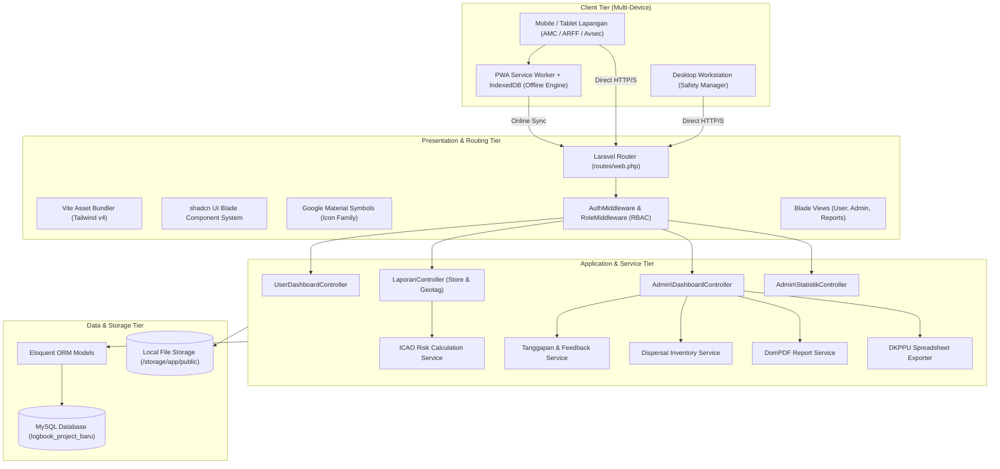
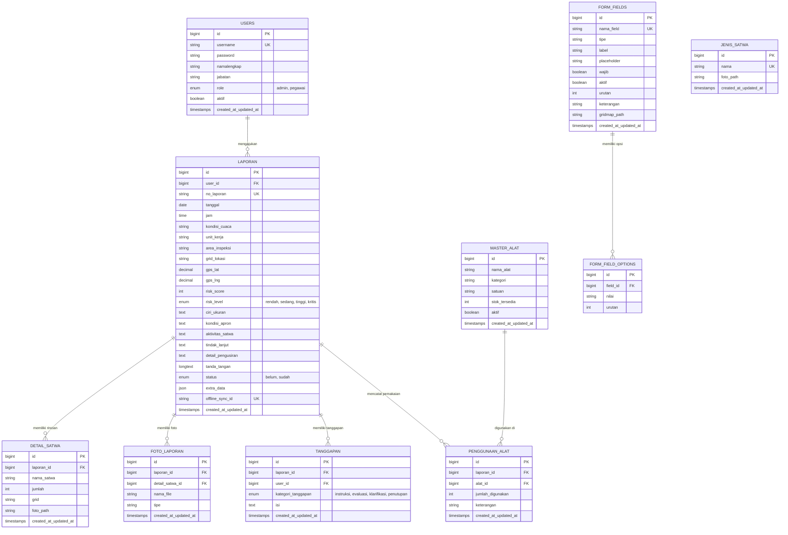
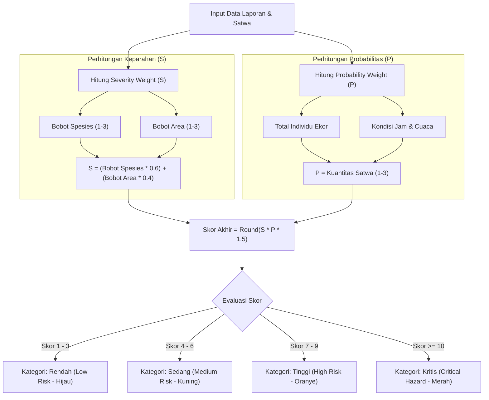
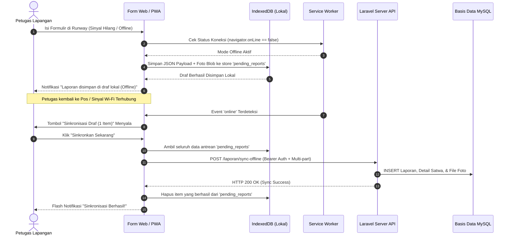
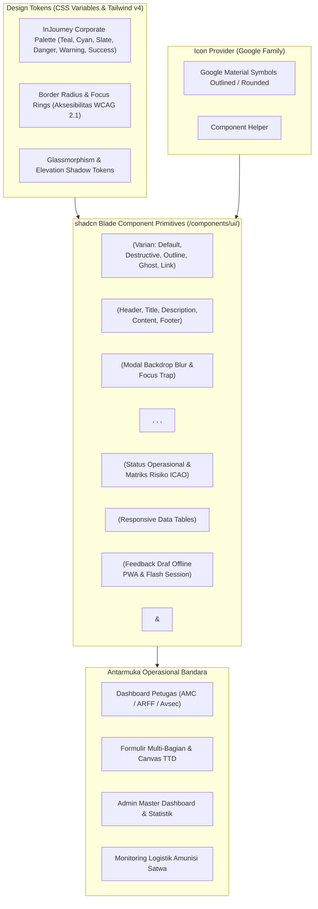
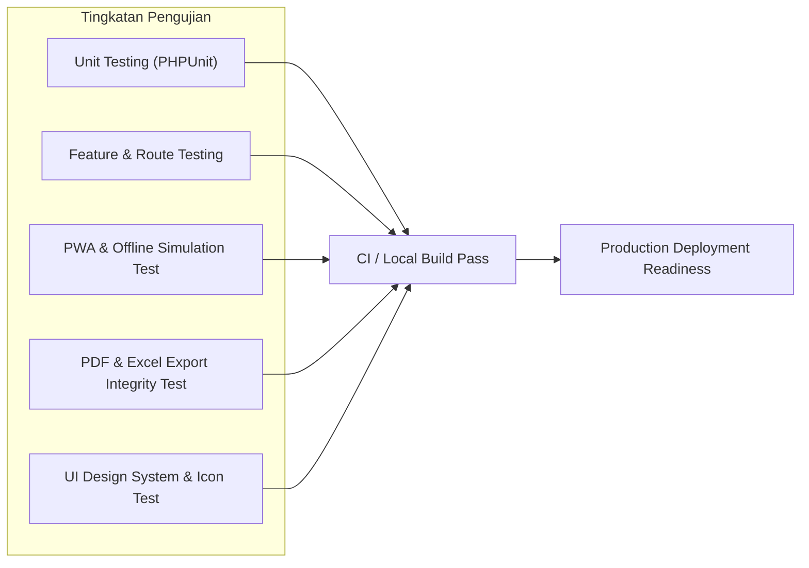

# TECHNICAL SPECIFICATION DOCUMENT (SPEC.MD)
## Wildlife Hazard Management System (Portal Satwa Liar)
### PT Angkasa Pura (Persero) — InJourney Airports
**Arsitektur Sistem, Spesifikasi Skema Basis Data, Algoritma Risiko ICAO, & API Endpoints**

---

## 1. Dokumen Kontrol & Ringkasan Arsitektur

| Parameter | Spesifikasi Teknis |
| :--- | :--- |
| **Sistem** | Wildlife Hazard Management Logbook System (Portal Satwa Liar) |
| **Versi Spesifikasi** | 2.0.0-PROD |
| **Framework Inti** | Laravel 12.x (PHP 8.2+ / 8.5 compatible) |
| **Frontend Stack** | Blade Templates, Tailwind CSS v4, Vite 8.x, Vanilla JS ES6+, **shadcn UI Blade Components Architecture** |
| **Pustaka Pendukung & Aset** | **Google Material Symbols (Google Icon Family)**, `Chart.js` (Visualisasi Data), `SignaturePad.js` (Canvas TTD), `barryvdh/laravel-dompdf` (PDF Engine), `phpoffice/phpspreadsheet` (Excel Engine) |
| **Basis Data** | MySQL 8.0+ / MariaDB 10.5+ (Engine: InnoDB, Charset: utf8mb4) |
| **Kepatuhan Regulasi**| ICAO Annex 14 Bab 9, ICAO Doc 9137 Part 3, Pedoman Ditjen Hubud (DKPPU) |

### 1.1 Diagram Arsitektur Sistem (High-Level Architecture)



---

## 2. Spesifikasi Skema Basis Data (Database Data Dictionary)

Berikut adalah definisi menyeluruh dari struktur basis data `logbook_project_baru` termasuk entitas inti dan ekstensi v2.0:



### 2.1 Rincian Kamus Data (Data Dictionary)

#### Tabel: `users`
Menyimpan kredensial dan hak akses seluruh personil bandara.
* `id`: BIGINT UNSIGNED, Primary Key, Auto Increment.
* `username`: VARCHAR(100), Unique, Not Null. Digunakan untuk login dinas.
* `password`: VARCHAR(255), Not Null (Bcrypt hashed).
* `namalengkap`: VARCHAR(150), Nullable. Nama personil/identitas dinas.
* `jabatan`: VARCHAR(100), Nullable. Unit kerja (AMC, ARFF, Avsec, SMS & OHS).
* `role`: ENUM('admin', 'pegawai'), Default 'pegawai', Not Null.
* `aktif`: TINYINT(1), Default 1 (1 = Aktif, 0 = Nonaktif).
* `created_at`, `updated_at`: TIMESTAMP.

#### Tabel: `laporan`
Menyimpan master data laporan logbook satwa liar yang diajukan petugas.
* `id`: BIGINT UNSIGNED, Primary Key, Auto Increment.
* `user_id`: BIGINT UNSIGNED, Foreign Key $\rightarrow$ `users(id)` ON DELETE CASCADE.
* `no_laporan`: VARCHAR(60), Unique, Not Null. Format: `BA-WHMS/AP1/[UNIT]/[BULAN]/[TAHUN]/[ID]`.
* `nama_petugas`: VARCHAR(100), Not Null.
* `tanggal`: DATE, Not Null. Tanggal inspeksi lapangan.
* `jam`: TIME, Nullable. Waktu penemuan satwa.
* `kondisi_cuaca`: VARCHAR(50), Not Null (Cerah, Berawan, Hujan Ringan, Hujan Lebat, Berkabut).
* `unit_kerja`: VARCHAR(100), Not Null (Apron Movement Control, ARFF, Airport Security, SMS & OHS).
* `area_inspeksi`: VARCHAR(100), Not Null (Runway, Taxiway, Apron, Perimeter, Drainage).
* `grid_lokasi`: VARCHAR(50), Nullable. Kode grid primer (misal: `K-10`).
* `gps_lat`: DECIMAL(10, 7), Nullable. Koordinat lintang dari GPS perangkat.
* `gps_lng`: DECIMAL(10, 7), Nullable. Koordinat bujur dari GPS perangkat.
* `risk_score`: INT, Default 1. Skor numerik hasil kalkulasi matriks ICAO.
* `risk_level`: ENUM('rendah', 'sedang', 'tinggi', 'kritis'), Default 'rendah'.
* `ciri_ukuran`: TEXT, Nullable. Morfologi dan estimasi dimensi satwa.
* `kondisi_apron`: TEXT, Nullable. Kondisi fisik satwa (Hidup, Mati, Tidak ditemukan).
* `aktivitas_satwa`: TEXT, Nullable. Perilaku satwa (Melintas, Bertengger, Mencari Makan, Melayang Rendah).
* `tindak_lanjut`: TEXT, Nullable. Status penanganan lapangan (Telah ditangani, Belum ditangani).
* `detail_pengusiran`: TEXT, Nullable. Uraian metode pengusiran yang diterapkan.
* `tanda_tangan`: LONGTEXT, Nullable. DataURL Base64 PNG tanda tangan digital petugas.
* `status`: ENUM('belum', 'sudah'), Default 'belum'. Status validasi oleh Safety Manager.
* `extra_data`: JSON, Nullable. Nilai input dari form field dinamis tambahan.
* `offline_sync_id`: VARCHAR(64), Nullable, Unique. UUID dari draf offline PWA.
* `created_at`, `updated_at`: TIMESTAMP.

#### Tabel: `detail_satwa`
Menyimpan rincian setiap spesies satwa dan multi-titik sebaran grid per laporan.
* `id`: BIGINT UNSIGNED, Primary Key, Auto Increment.
* `laporan_id`: BIGINT UNSIGNED, Foreign Key $\rightarrow$ `laporan(id)` ON DELETE CASCADE.
* `nama_satwa`: VARCHAR(100), Not Null.
* `jumlah`: INT, Default 1. Jumlah individu (ekor).
* `grid`: VARCHAR(20), Nullable. Kode grid spesifik sebaran satwa.
* `foto_path`: VARCHAR(255), Nullable. Path foto bukti satwa.
* `created_at`, `updated_at`: TIMESTAMP.

#### Tabel: `foto_laporan`
Menyimpan relasi berkas dokumentasi visual lapangan.
* `id`: BIGINT UNSIGNED, Primary Key, Auto Increment.
* `laporan_id`: BIGINT UNSIGNED, Foreign Key $\rightarrow$ `laporan(id)` ON DELETE CASCADE.
* `detail_satwa_id`: BIGINT UNSIGNED, Nullable, Foreign Key $\rightarrow$ `detail_satwa(id)` ON DELETE SET NULL.
* `nama_file`: VARCHAR(255), Not Null. Nama berkas tersimpan di `storage/app/public/uploads/`.
* `tipe`: VARCHAR(50), Default 'satwa' ('satwa' atau 'extra').
* `created_at`, `updated_at`: TIMESTAMP.

#### Tabel: `tanggapan`
Menyimpan alur komunikasi umpan balik dua arah antara Safety Manager dan Petugas Lapangan.
* `id`: BIGINT UNSIGNED, Primary Key, Auto Increment.
* `laporan_id`: BIGINT UNSIGNED, Foreign Key $\rightarrow$ `laporan(id)` ON DELETE CASCADE.
* `user_id`: BIGINT UNSIGNED, Foreign Key $\rightarrow$ `users(id)` ON DELETE CASCADE.
* `kategori_tanggapan`: ENUM('instruksi', 'evaluasi', 'klarifikasi', 'penutupan'), Default 'instruksi'.
* `isi`: TEXT, Not Null. Isi arahan dinas atau respon dari petugas.
* `created_at`, `updated_at`: TIMESTAMP.

#### Tabel: `master_alat_dispersal`
Daftar master peralatan dan amunisi pengusir satwa liar (*Bird Dispersal Gear*).
* `id`: BIGINT UNSIGNED, Primary Key, Auto Increment.
* `nama_alat`: VARCHAR(150), Not Null (misal: *Bird Scaring Cartridge 12GA*, *Gas Propane Cannon*, *Handheld Green Laser*).
* `kategori`: VARCHAR(100), Not Null (Piroteknik, Akustik, Optik, Fisik).
* `satuan`: VARCHAR(50), Not Null (Butir, Dentuman, Menit, Unit).
* `stok_tersedia`: INT, Default 0. Stok aktif logistik operasional.
* `aktif`: TINYINT(1), Default 1.
* `created_at`, `updated_at`: TIMESTAMP.

#### Tabel: `penggunaan_alat_dispersal`
Mencatat konsumsi peralatan dan amunisi pada setiap tindakan pengusiran satwa.
* `id`: BIGINT UNSIGNED, Primary Key, Auto Increment.
* `laporan_id`: BIGINT UNSIGNED, Foreign Key $\rightarrow$ `laporan(id)` ON DELETE CASCADE.
* `alat_id`: BIGINT UNSIGNED, Foreign Key $\rightarrow$ `master_alat_dispersal(id)` ON DELETE CASCADE.
* `jumlah_digunakan`: INT, Default 1.
* `keterangan`: VARCHAR(255), Nullable.
* `created_at`, `updated_at`: TIMESTAMP.

---

## 3. Spesifikasi API & Struktur Routing (Route Tree)

Seluruh antarmuka web dilindungi oleh middleware keamanan Laravel dengan pembagian hak akses (*Role-Based Access Control*):

| HTTP Method | Route URL | Controller Action | Middleware | Deskripsi Fungsi |
| :--- | :--- | :--- | :--- | :--- |
| `GET` | `/login` | `AuthController@showLogin` | `guest` | Antarmuka login berlatar dinas InJourney |
| `POST` | `/login` | `AuthController@login` | `guest`, `throttle:5,1` | Verifikasi kredensial & regenerate session |
| `POST` | `/logout` | `AuthController@logout` | `auth` | Invalidate session & logout |
| **Grup Pegawai** | | | `auth, role:pegawai` | |
| `GET` | `/dashboard` | `UserDashboardController@index` | | Tampilan metrik pribadi & riwayat laporan |
| `GET` | `/laporan/create` | `LaporanController@create` | | Form pelaporan 5 bagian + GPS & Grid |
| `POST` | `/laporan` | `LaporanController@store` | | Validasi, simpan laporan, hitung risiko ICAO |
| `GET` | `/laporan/{id}/detail` | `LaporanController@detail` | | JSON modal pratinjau laporan & thread tanggapan |
| `POST` | `/laporan/{id}/tanggapan`| `LaporanController@storeTanggapan` | | Kirim respon/balasan ke Safety Manager |
| `POST` | `/laporan/sync-offline` | `LaporanController@syncOffline` | | Endpoint API sinkronisasi antrean draf PWA |
| **Grup Admin** | `/admin/*` | | `auth, role:admin` | |
| `GET` | `/admin` | `Admin\DashboardController@index` | | Master dashboard operasional bandara |
| `GET` | `/admin/laporan/{id}/detail` | `Admin\DashboardController@getDetail`| | Mengambil rincian data laporan lengkap |
| `POST` | `/admin/laporan/{id}/update` | `Admin\DashboardController@update` | | Memperbarui data & status validasi |
| `POST` | `/admin/laporan/{id}/delete` | `Admin\DashboardController@destroy` | | Hapus laporan dari basis data |
| `POST` | `/admin/laporan/{id}/tanggapan`| `Admin\DashboardController@storeTanggapan`| | Safety manager menerbitkan instruksi dinas |
| `GET` | `/admin/statistik` | `Admin\StatistikController@index` | | Visualisasi stacked bar chart & top satwa |
| `GET` | `/admin/manajemen` | `Admin\ManajemenController@index` | | Form builder, master satwa, & user CRUD |
| `GET` | `/admin/laporan/{id}/cetak` | `Admin\ReportController@cetak` | | Cetak Berita Acara via browser |
| `GET` | `/admin/laporan/{id}/pdf` | `Admin\ReportController@downloadPdf`| | Unduh Berita Acara PDF server-side murni |
| `GET` | `/admin/laporan/bundle-pdf` | `Admin\ReportController@bundlePdf` | | Unduh Buku Log Gabungan 1 Bulan (PDF) |
| `GET` | `/admin/export-excel` | `Admin\ReportController@exportExcel` | | Unduh Spreadsheet Excel standar DKPPU |

---

## 4. Algoritma & Logika Bisnis (Business Logic Specs)

### 4.1 Algoritma Matriks Penilaian Risiko Bahaya Satwa (*ICAO Doc 9137*)
Kalkulasi otomatis risiko bahaya satwa dihitung saat *event* penyimpanan laporan (`LaporanController@store`):

$$\text{Risk Score} = \text{Severity Weight } (S) \times \text{Probability Weight } (P)$$



#### Tabel Parameter Bobot Kuantitatif:
1. **Bobot Spesies Satwa**:
   * *Skor 3 (Tinggi)*: Burung berukuran besar atau berkawanan (*flocking birds*) seperti Burung Kuntul, Blekok, Elang, Ular Sanca, Anjing Liar.
   * *Skor 2 (Sedang)*: Biawak ukuran sedang, Kucing liar, Burung Dara.
   * *Skor 1 (Rendah)*: Burung gereja soliter, Serangga terbang kecil.
2. **Bobot Zona / Area Inspeksi**:
   * *Skor 3 (Kritis)*: `Runway` (Area kontak roda pesawat dan *take-off/landing*).
   * *Skor 2 (Tinggi)*: `Taxiway` dan `Apron` (Area pergerakan dan manuver pesawat).
   * *Skor 1 (Sedang)*: `Perimeter`, `Kanal/Drainage`, `Gedung Operasional`.
3. **Bobot Kuantitas Satwa**:
   * 1 Ekor = Skor 1.
   * 2 – 5 Ekor = Skor 2.
   * > 5 Ekor (Kawanan) = Skor 3.

---

### 4.2 Algoritma Bounding-Box Geofencing (GPS to Grid Bandara)
Untuk mengubah koordinat numerik gawai petugas (`Latitude`, `Longitude`) menjadi kode Grid Bandara (Baris `A-L`, Kolom `1-29`), sistem menggunakan pemetaan batas kotak bujur-lintang:

```javascript
// Pseudocode Geofencing Matriks Grid Bandara
function mapGpsToAirportGrid(lat, lng) {
    const AIRPORT_BOUNDS = {
        minLat: -7.385000, maxLat: -7.375000,
        minLng: 112.775000, maxLng: 112.805000
    };
    
    // Periksa apakah perangkat berada di dalam wilayah bandara
    if (lat < AIRPORT_BOUNDS.minLat || lat > AIRPORT_BOUNDS.maxLat ||
        lng < AIRPORT_BOUNDS.minLng || lng > AIRPORT_BOUNDS.maxLng) {
        return null; // Di luar jangkauan sisi udara
    }

    const rows = ['A','B','C','D','E','F','G','H','I','J','K','L'];
    const totalCols = 29;

    const latRatio = (AIRPORT_BOUNDS.maxLat - lat) / (AIRPORT_BOUNDS.maxLat - AIRPORT_BOUNDS.minLat);
    const lngRatio = (lng - AIRPORT_BOUNDS.minLng) / (AIRPORT_BOUNDS.maxLng - AIRPORT_BOUNDS.minLng);

    const rowIndex = Math.min(Math.floor(latRatio * rows.length), rows.length - 1);
    const colIndex = Math.min(Math.floor(lngRatio * totalCols) + 1, totalCols);

    return `${rows[rowIndex]}-${colIndex}`;
}
```

---

### 4.3 Alur Kerja PWA & Offline Storage (IndexedDB Sync)



---

### 4.4 Pipeline Canvas Watermark Foto Otomatis

Sebelum foto bukti satwa diunggah dari peramban ke peladen, peramban memproses gambar melalui pipeline HTML5 Canvas:
1. Tangkap berkas gambar dari `<input type="file" capture="environment">`.
2. Muat berkas ke elemen `Image()` JavaScript.
3. Skalakan resolusi gambar secara proporsional ke resolusi maksimum $1920 \times 1080$ piksel.
4. Gambar lapisan semi-transparan hitam (`rgba(0, 0, 0, 0.65)`) setinggi 65 piksel di dasar kanvas.
5. Bubuhkan teks dinas resmi menggunakan font tebal (warna putih, ukuran 16px):
   * *Baris 1*: `INJOURNEY AIRPORTS - WILDLIFE HAZARD RECORD`
   * *Baris 2*: `WAKTU: [YYYY-MM-DD HH:mm:ss] | GRID: [K-10] | GPS: [-7.3798, 112.7875] | OPR: [AMC UNIT]`
6. Kompresi kanvas ke format `image/jpeg` dengan kualitas $0.82$. Ukuran berkas terkompresi berkisar antara 400 KB – 800 KB (optimal untuk koneksi mobile bandara).

---

## 5. Spesifikasi Desain Antarmuka (UI/UX), Komponen shadcn, & Google Icon Family

Untuk mempercepat pengembangan antarmuka pengguna (*rapid UI development*), memastikan konsistensi visual di seluruh modul dinas, serta menghadirkan pengalaman pengguna (*user experience*) yang elegan dan responsif, sistem mengadopsi pendekatan desain modular berbasis **shadcn UI** yang disesuaikan untuk Laravel Blade dan pustaka ikon **Google Material Symbols (Google Family Icons)**.

### 5.1 Arsitektur Desain Sistem shadcn UI untuk Laravel Blade

Filosofi shadcn UI mengedepankan prinsip kepemilikan kode penuh (*code ownership*), ketiadaan beban ketergantungan runtime berlebih (*zero runtime overhead*), serta pemanfaatan kelas utilitas Tailwind CSS. Pada aplikasi ini, arsitektur shadcn diwujudkan dalam bentuk pustaka komponen Blade atomik mandiri (`resources/views/components/ui/`) yang dikombinasikan dengan sistem variabel token desain:



#### 5.1.1 Definisi Token Warna & Tema (Tailwind CSS v4 `@theme`)
Sistem mengadopsi skema warna korporat PT Angkasa Pura Indonesia (InJourney) yang dipadukan dengan standar netral modern shadcn UI:

```css
@theme {
    /* Brand Corporate InJourney */
    --color-primary: #00A9C1;              /* InJourney Teal */
    --color-primary-hover: #008fa3;        /* Darker Teal */
    --color-primary-foreground: #ffffff;
    --color-brand-cyan: #00C4DF;           /* InJourney Cyan */
    --color-brand-navy: #0f172a;           /* Deep Slate / Navy */

    /* shadcn Semantic Tokens */
    --color-background: #f8fafc;          /* Slate 50 */
    --color-foreground: #0f172a;          /* Slate 900 */
    --color-card: #ffffff;
    --color-card-foreground: #0f172a;
    --color-popover: #ffffff;
    --color-popover-foreground: #0f172a;
    --color-muted: #f1f5f9;               /* Slate 100 */
    --color-muted-foreground: #64748b;    /* Slate 500 */
    --color-border: #e2e8f0;              /* Slate 200 */
    --color-input: #e2e8f0;
    --color-ring: #00A9C1;                /* Focus Ring Primary */

    /* Status & ICAO Risk Tokens */
    --color-risk-low: #10b981;            /* Emerald 500 (Skor 1-3) */
    --color-risk-medium: #f59e0b;         /* Amber 500 (Skor 4-6) */
    --color-risk-high: #f97316;           /* Orange 500 (Skor 7-9) */
    --color-risk-critical: #ef4444;       /* Red 500 (Skor >= 10) */
    --color-destructive: #dc2626;         /* Red 600 */
    --color-destructive-foreground: #ffffff;

    /* Radius & Typography */
    --radius-sm: 0.25rem;
    --radius-md: 0.5rem;
    --radius-lg: 0.75rem;
    --radius-xl: 1rem;
    --font-sans: 'DM Sans', system-ui, -apple-system, sans-serif;
}
```

---

### 5.2 Katalog Komponen Standar shadcn UI (Blade Component Library)

Pustaka antarmuka dibangun menggunakan Blade component native (`<x-ui.*>`) yang dapat dikombinasikan dengan mudah:

| Komponen Blade | Varian (*Variants*) | Ukuran (*Sizes*) | Implementasi & Penerapan di Sistem |
| :--- | :--- | :--- | :--- |
| `<x-ui.button>` | `default`, `destructive`, `outline`, `secondary`, `ghost`, `link` | `sm`, `default`, `lg`, `icon` | Tombol simpan laporan, hapus baris satwa, cetak PDF, aksi sinkronisasi offline, dan navigasi tab. Dilengkapi efek mikro-interaksi `active:scale-[0.98]` dan state loading spinner. |
| `<x-ui.card>` | `default`, `glassmorphism`, `interactive` | Auto / Full | Membungkus widget KPI statistik, kartu profil dinas petugas, kontainer form pelaporan, dan ringkasan eksekutif logbook. Terdiri dari `<x-ui.card-header>`, `<x-ui.card-title>`, `<x-ui.card-description>`, `<x-ui.card-content>`, `<x-ui.card-footer>`. |
| `<x-ui.badge>` | `default`, `secondary`, `outline`, `destructive`, `risk-low`, `risk-med`, `risk-high`, `risk-crit` | `sm`, `default` | Menampilkan kategori tingkat bahaya ICAO, unit kerja pelapor (`AMC`, `ARFF`), status validasi (`Selesai`, `Menunggu`), serta kategori amunisi dispersal. |
| `<x-ui.dialog>` | Standard Modal, Fullscreen Image Preview | `sm`, `md`, `lg`, `xl`, `full` | Dialog pratinjau lengkap detail laporan berita acara, modal riwayat tanggapan dua arah, inspeksi foto bukti satwa resolusi tinggi, dan konfirmasi validasi/penghapusan data. Dilengkapi transisi fade-in & backdrop blur. |
| `<x-ui.input>` | Text, Number, Date, Time, File, GPS Geotag | Default | Elemen masukan teks dengan border halus, state validasi error (`border-destructive focus-visible:ring-destructive`), serta integrasi ikon prefix/suffix Google Family. |
| `<x-ui.select>` | Native / Searchable Select | Default | Pemilihan unit kerja, area inspeksi sisi udara (`Runway`, `Taxiway`, `Apron`), kondisi cuaca, dan kategori alat pengusir satwa liar. |
| `<x-ui.textarea>` | Auto-expand / Fixed rows | Default | Uraian aktivitas satwa, morfologi satwa, instruksi dinas evaluasi Safety Manager, dan detail tindakan pengusiran. |
| `<x-ui.table>` | Striped, Hoverable, Borderless | Responsive | Tabel pemantauan logbook bandara, daftar inventaris stok amunisi dispersal, dan riwayat tanggapan dinas dengan paginasi terintegrasi. |
| `<x-ui.alert>` | `info`, `success`, `warning`, `destructive` | Default | Banner status koneksi PWA (Online vs Offline), notifikasi hasil sinkronisasi antrean laporan, serta pesan sukses penyimpanan data. |
| `<x-ui.tabs>` | Segmented Pills, Underline Tab | `sm`, `default` | Navigasi beralih antar 5 bagian formulir pelaporan (*Informasi Dasar*, *Rincian Satwa*, *Dispersal*, *Foto Bukti*, *Pengesahan TTD*). |

---

### 5.3 Standar Iconography: Google Material Symbols (Google Family Icons)

Seluruh ikon antarmuka menggunakan **Google Material Symbols (Google Font & Icon Family)**. Standar ini dipilih karena kelengkapan glif, fleksibilitas variasi optik (*variable font*), ketajaman visual pada layar beresolusi tinggi (HiDPI), dan kesesuaian dengan standar visual modern Google Material 3.

#### 5.3.1 Metode Pemuatan & Konfigurasi Google Symbols
Ikon dimuat melalui Google Fonts CDN di `layouts/app.blade.php`:

```html
<!-- Google Material Symbols (Outlined & Rounded Variable Settings) -->
<link rel="stylesheet" href="https://fonts.googleapis.com/css2?family=Material+Symbols+Outlined:opsz,wght,FILL,GRAD@20..48,100..700,0..1,-50..200" />
```

Atribut CSS Variabel Standar:
* **Optical Size (`opsz`)**: `20px` (ikon pada badge & tombol kecil), `24px` (standar navigasi & formulir), `40px` (hero metrics).
* **Weight (`wght`)**: `400` (normal UI), `500` (medium/penekanan), `600` (bold status).
* **Fill (`FILL`)**: `0` (outline default untuk tampilan bersih), `1` (solid untuk status aktif/terpilih).
* **Grade (`GRAD`)**: `0` (normal), `0.25` (kontras tinggi pada latar gelap).

Sistem menyediakan helper Blade Component `<x-icon>`:
```blade
{{-- Penggunaan Komponen Ikon Blade --}}
<x-icon name="pest_control" class="w-5 h-5 text-primary" />
<x-icon name="warning" class="w-4 h-4 text-amber-500" fill />
```

#### 5.3.2 Kamus Pemetaan Ikon Standar Operasional Satwa Liar Bandara

Berikut adalah standardisasi nama glif Google Material Symbols yang wajib digunakan di seluruh antarmuka sistem:

| Kategori Modul | Glif Google Symbols | Nama Ikon (`name`) | Konteks Penggunaan Operasional Bandara |
| :--- | :--- | :--- | :--- |
| **Navigasi & Menu** | 📊 | `dashboard` | Menu utama ringkasan operasional bandara |
| | 📝 | `description` | Modul formulir dan rekapitulasi data laporan satwa |
| | 📈 | `analytics` | Modul visualisasi statistik bahaya satwa & tren bulanan |
| | 📦 | `inventory_2` | Modul inventaris amunisi & peralatan pengusir satwa |
| | ⚙️ | `tune` / `settings` | Pengaturan sistem, form builder dinamis, & manajemen user |
| | 🔔 | `notifications` | Indikator lonceng instruksi dan tanggapan baru |
| | 🚪 | `logout` | Keluar sesi operasional petugas/admin |
| **Sisi Udara & Satwa**| 🪲 | `pest_control` | Indikator umum satwa liar / gangguan hazard satwa |
| | 🦅 | `flutter_dash` | Spesies burung liar (*avian hazard*) di runway |
| | 🦎 | `cruelty_free` / `pets`| Mamalia / reptil liar (biawak, anjing liar, ular) |
| | 🛫 | `flight_takeoff` | Area Runway / jalur lepas landas |
| | 🛬 | `flight_land` | Area Taxiway & Apron / pergerakan pesawat |
| | 🗺️ | `grid_on` | Pemilihan dan penandaan Grid Lokasi Bandara (A-L, 1-29) |
| | 📍 | `location_on` / `my_location`| Akuisisi koordinat GPS otomatis via peramban lapangan |
| | 📸 | `photo_camera` | Pengambilan foto bukti temuan satwa liar langsung dari kamera |
| | ✍️ | `draw` | Kanvas tanda tangan digital (*electronic sign-off*) |
| **Tingkat Risiko ICAO**| 🟢 | `check_circle` | Tingkat risiko Rendah (Low Risk — Hijau) |
| | 🟡 | `warning` | Tingkat risiko Sedang (Medium Risk — Kuning) |
| | 🟠 | `error` | Tingkat risiko Tinggi (High Risk — Oranye) |
| | 🔴 | `dangerous` | Tingkat risiko Kritis (Critical Hazard — Merah) |
| | 🛡️ | `health_and_safety` / `shield` | Validasi kepatuhan Divisi Safety & OHS |
| **Peralatan Dispersal**| 📢 | `campaign` | Pengusiran metode Akustik (Sirine, Megafon, Suara Predator) |
| | 💥 | `flare` | Pengusiran metode Piroteknik (Bird Scaring Cartridge 12GA) |
| | 🔦 | `flash_on` / `light_mode` | Pengusiran metode Optik (Handheld Green Laser 532nm) |
| | ✋ | `back_hand` | Pengusiran/Penanganan metode Fisik & Penjebakan |
| **Konektivitas & Ekspor**| 🌐 | `wifi` | Status peramban terhubung internet (Online) |
| | ⚡ | `wifi_off` | Status peramban terputus / bekerja offline di runway |
| | 🔄 | `sync` | Tombol sinkronisasi antrean draf laporan IndexedDB ke server |
| | 📄 | `picture_as_pdf` | Unduh Berita Acara resmi format PDF server-side |
| | 📑 | `table_chart` | Unduh Spreadsheet Excel standar Ditjen Hubud (DKPPU) |
| | 🖨️ | `print` | Perintah cetak langsung format formulir fisik |

---

## 6. Spesifikasi Mesin Pelaporan & Ekspor Dokumen

### 6.1 Spesifikasi Berita Acara PDF Server-Side (`barryvdh/laravel-dompdf`)
* **Ukuran Kertas**: ISO A4 ($210 \times 297$ mm), Orientasi Portrait.
* **Margin Halaman**: Atas 15mm, Kiri 20mm, Kanan 15mm, Bawah 15mm.
* **Elemen Kop Surat**:
  * Logo Resmi BUMN / InJourney Airports di pojok kiri atas.
  * Nama Instansi: `PT ANGKASA PURA INDONESIA`.
  * Unit Kerja: `AIRPORT OPERATION, SAFETY, SECURITY & ENVIRONMENT DIVISION`.
  * Judul Dokumen: `BERITA ACARA PENGENDALIAN SATWA LIAR (WILDLIFE HAZARD LOGBOOK)`.
  * Nomor Registrasi Dokumen: `No: BA-WHMS/{UNIT}/{BULAN}/{TAHUN}/{ID}`.
* **Komponen Isi**:
  1. *Identitas Pengamatan*: Hari/Tanggal, Pukul, Kondisi Cuaca, Area dan Grid Temuan.
  2. *Matriks Temuan Satwa*: Tabel berisi Jenis Satwa, Nama Ilmiah, Jumlah (Ekor), Foto Bukti Lapangan Ber-watermark, dan Tingkat Risiko Bahaya ICAO.
  3. *Tindakan Pengendalian / Dispersal*: Kronologi tindakan pengusiran, amunisi yang ditembakkan, dan hasil akhir.
  4. *Kolom Validasi & Tanda Tangan*: Tanda Tangan Basah Digital Pelapor berdampingan dengan Tanda Tangan Pengesahan Safety Manager.

### 6.2 Spesifikasi Ekspor Spreadsheet Excel Standar DKPPU / Kemenhub
* **Format Berkas**: OpenXML Spreadsheet (`.xlsx`).
* **Struktur Kolom**:
  * `Kolom A`: Nomor Urut (`No`)
  * `Kolom B`: Nomor Berita Acara (`No. Registrasi Laporan`)
  * `Kolom C`: Tanggal & Jam Pemantauan (`YYYY-MM-DD HH:mm`)
  * `Kolom D`: Unit Dinas Pelapor (`AMC / ARFF / Security / SMS`)
  * `Kolom E`: Nama Personil Lapangan
  * `Kolom F`: Kondisi Cuaca & Kecepatan Angin
  * `Kolom G`: Area Inspeksi Sisi Udara (`Runway / Taxiway / Apron / Perimeter`)
  * `Kolom H`: Kode Grid Lokasi (`K-10`, `D-9`, dll.)
  * `Kolom I`: Koordinat GPS Lintang (`Latitude`)
  * `Kolom J`: Koordinat GPS Bujur (`Longitude`)
  * `Kolom K`: Nama Spesies Satwa
  * `Kolom L`: Jumlah Individu (`Ekor`)
  * `Kolom M`: Skor Risiko ICAO (`1 - 12`)
  * `Kolom N`: Tingkat Kategori Bahaya (`Rendah / Sedang / Tinggi / Kritis`)
  * `Kolom O`: Perilaku / Aktivitas Satwa
  * `Kolom P`: Metode Pengusiran Satwa
  * `Kolom Q`: Amunisi / Alat Dispersal Terpakai
  * `Kolom R`: Status Tindak Lanjut (`Selesai / Menunggu`)
  * `Kolom S`: Tanggal & Validator Safety Unit
* **Formula Baris Ringkasan Otomatis**:
  * `Total Individu Satwa`: `=SUM(L4:L[N])`
  * `Rata-rata Skor Risiko`: `=AVERAGE(M4:M[N])`
  * `Tingkat Penyelesaian Laporan`: `=COUNTIF(R4:R[N], "Selesai") / COUNTA(R4:R[N]) * 100%`

---

## 7. Persyaratan Keamanan & Non-Fungsional

| Kategori | Parameter | Kriteria Spesifikasi Teknis |
| :--- | :--- | :--- |
| **Keamanan Data** | Perlindungan Autentikasi | Enkripsi Bcrypt dengan cost parameter dinamis. Perlindungan Session Hijacking dan Regenerasi ID Sesi pada setiap proses login. |
| **Keamanan Data** | Perlindungan Form Web | Validasi CSRF Token pada seluruh request POST. Proteksi SQL Injection via PDO Prepared Statements Eloquent ORM. Sanitasi XSS via Blade `{{ }}` auto-escaping. |
| **Keamanan Data** | Validasi Unggah Berkas | Validasi ketat format berkas gambar (`image/jpeg, image/png, image/webp`). Batasan ukuran berkas maksimum 5 MB di server (meskipun telah dikompresi di sisi klien). |
| **Integritas Transaksi**| Basis Data ACID | Penulisan laporan multi-tabel (`laporan`, `detail_satwa`, `foto_laporan`, `penggunaan_alat`) wajib dibungkus dalam blok `DB::transaction()` untuk menjamin ketiadaan data yatim (*orphaned records*). |
| **Keandalan (Reliability)**| Offline Fault Tolerance | Sistem tidak boleh kehilangan input laporan jika jaringan terputus tiba-tiba di lapangan; draf harus tersimpan aman di IndexedDB perangkat. |
| **Performa Respons** | Response Time Target | Dashboard Admin dan User harus ter-render dalam waktu < 800ms pada volume 10.000 data laporan dengan pengindeksan basis data yang tepat. |

---

## 8. Rencana Pengujian & Verifikasi (Test Suite Matrix)



| ID Pengujian | Kasus Uji | Metode & Ekspektasi |
| :--- | :--- | :--- |
| `TEST-AUTH-01` | Role Middleware Protection | Akun `pegawai` yang mengakses `/admin` dialihkan dengan kode respons 403 / Redirect aman. |
| `TEST-RISK-01` | Kalkulasi Matriks Risiko ICAO | Input 10 ekor Burung Kuntul di Runway menghasilkan skor risiko $\ge 10$ dan kategori `kritis`. |
| `TEST-FEED-01` | Thread Tanggapan Dua Arah | Tanggapan admin muncul secara *real-time* di modal riwayat laporan pegawai bersangkutan. |
| `TEST-SYNC-01` | PWA Offline Sync Deduplication | Pengunggahan draf dengan `offline_sync_id` yang sama ditolak peladen untuk mencegah duplikasi data. |
| `TEST-PDF-01` | Server-side PDF Compilation | Berita Acara PDF berhasil digenerate dalam format A4 murni lengkap dengan gambar tanda tangan dan logo. |
| `TEST-XLS-01` | Ekspor Spreadsheet DKPPU | Berkas Excel memuat seluruh kolom baku dan formula hitung otomatis berfungsi tanpa *corrupt*. |
| `TEST-UI-01` | shadcn Blade Component System | Tombol, Card, Dialog, Badge, dan Input ter-render sesuai token tema Tailwind v4 dan lolos uji responsif multi-device. |
| `TEST-ICON-01` | Google Symbols Font Delivery | Seluruh glif Material Symbols (opsz 20/24, FILL 0/1) terpanggil tanpa kegagalan aset CDN / FOUT. |
